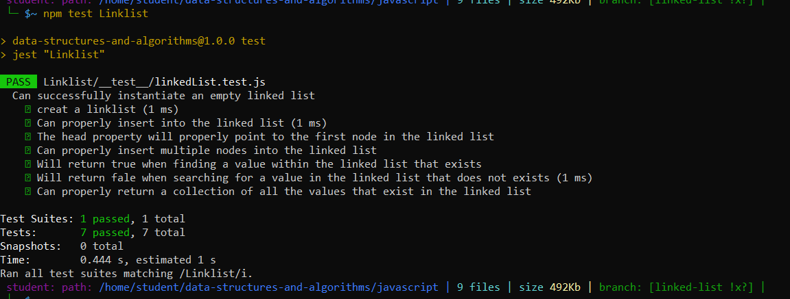

# Singly Linked List

## Link List :
 is a sequence of Nodes that are connected/linked to each other. The most defining feature of a Linked List is that each Node references the next Node in the link.
 For singl linked List :it is the simplest type of linked list in which every node contains some data and a pointer to the next node of the same data type, A single linked list allows traversal of data only in one way. 
 ------------------------------------------------------------------------------------------------------------------------------------------------
 ## Challenge:
 in this challenge I lerned how to implemented a linked list, and how to know the length for it and add node, I used lingth and each time we go throuth the Insert functuion and insert to make it plus one.

## Test driven :
- Can successfully instantiate an empty linked list
- Can properly insert into the linked list
- The head property will properly point to the first node in the linked list
- Can properly insert multiple nodes into the linked list
- Will return true when finding a value within the linked list that exists
- Will return false when searching for a value in the linked list that does not exist
- Can properly return a collection of all the values that exist in the linked list
Screen shoot for the test:

------------------------------------------------------------------------------------------------------------------------------------

# Approach & Efficiency:

### Used Classes to implement the linked list with the O(1) and O(n) for it's methods .

# API:

### insert
Arguments: value
Returns: nothing
adds a new node with that value to the head of the list with an O(1) Time performance, And if the head doesnt equal null it will add that value to the next node.

includes
Arguments: value
Returns: Boolean
Indicates whether that value exists as a Node’s value somewhere within the list.

to string 
Arguments: none
Returns: a string representing all the values in the Linked List, formatted as:
"{ a } -> { b } -> { c } -> NULL"

