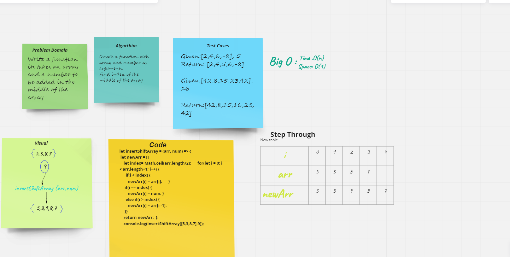
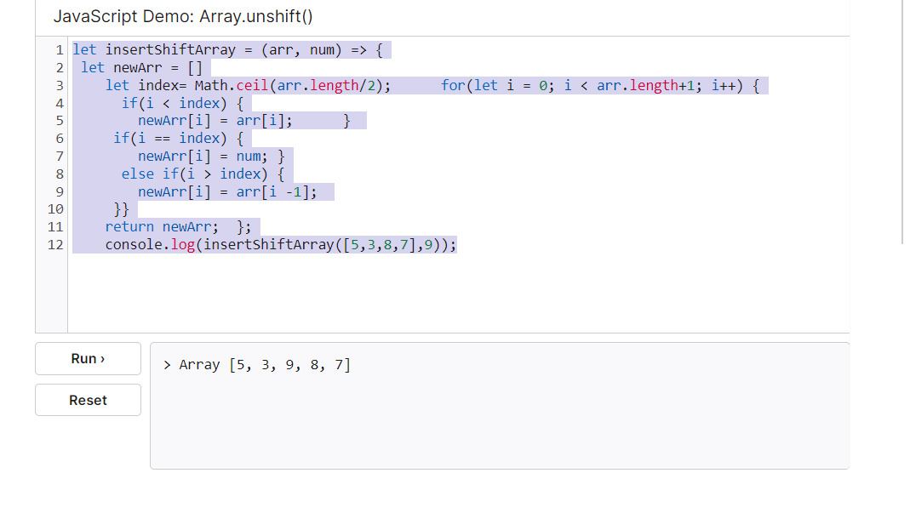

#  Insert to Middle of an Array
## Write a function its takes an array and a number to be added in the middle of the array.

# Whiteboard Process:

# Screenshoot For testing:

# Approach & Efficiency:

###  Used loop approach (for), it has a O(n) as time complexity and O(1) as space complexity.

[Code challenge](../code-challenges)
