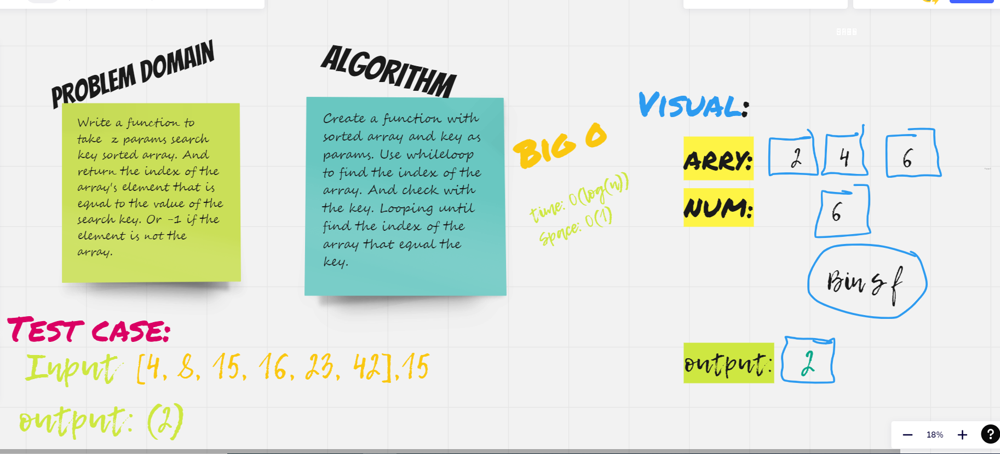
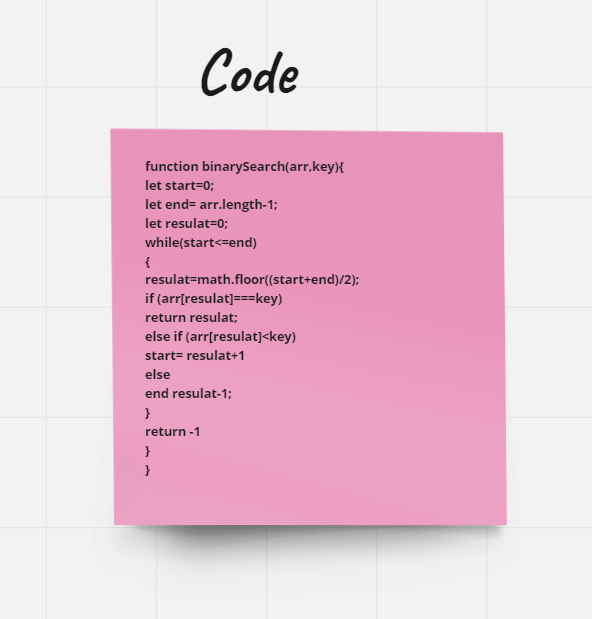

## Binary Search of Sorted Array

### Description of the challenge 

Write a function to take  2 params search key and sorted array. And return the index of the array's element that is equal to the value of the search key. Or -1 if the element is not the array.

## Whiteboard Process

## Approach & Efficiency:

 used (while) and Big O was  O(log(n)) as time complexity and O(1) as space complexity.