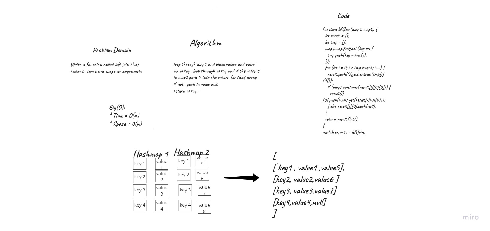
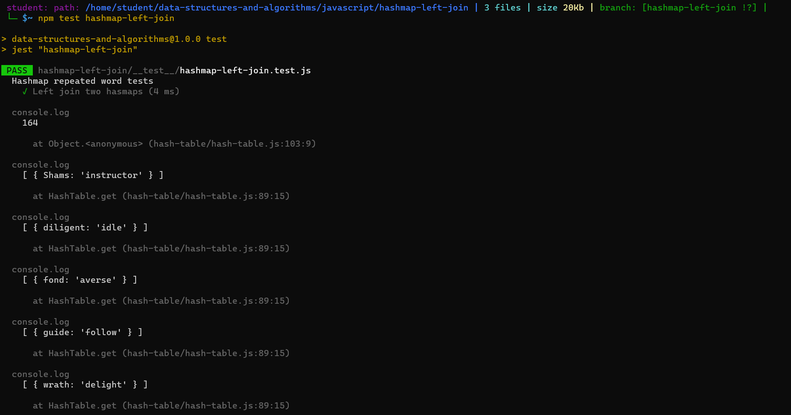

# Hashmap Left Join
Write a function called left join that takes in two hash maps as arguments

* hashmap 1 has word strings as keys, and a synonym of the key as a value
* hashmap 2 has word strings as keys and the antonyms of the key as values
* Combine the key and corresponding values (if they exist) into a new data structure according to LEFT JOIN logic.
* LEFT JOIN means all the values in the first hashmap are returned, and if values exist in the “right” hashmap, they are appended to the result row.
* If no values exist in the right hashmap, then some flavor of NULL should be appended to the result row.

## Whiteboard Process

## test

## Approach & Efficiency

* time complexity: O(n) 
* space complexity: O(n)