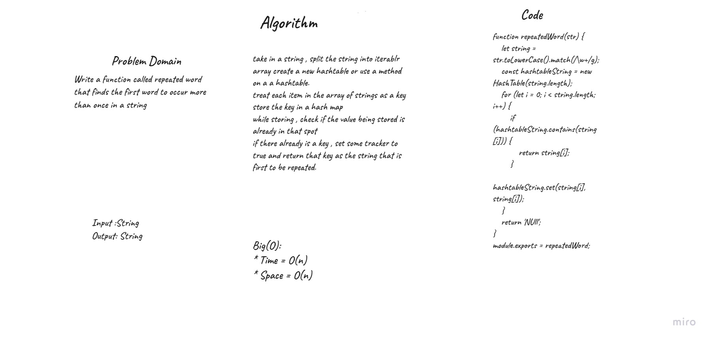
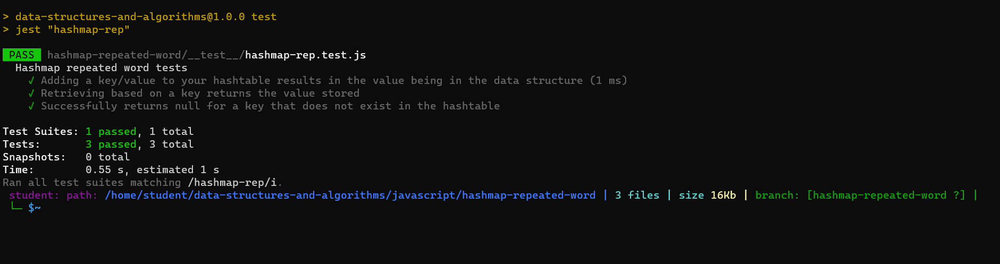

# Hashmap Repeated Word
 Find the first repeated word in a book.

## Challenge
Write a function called repeated word that finds the first word to occur more than once in a string
```
repeatedWord(string)
```

## whiteboard


## test


## Big(O):
* Time = O(n)
* Space = O(n)