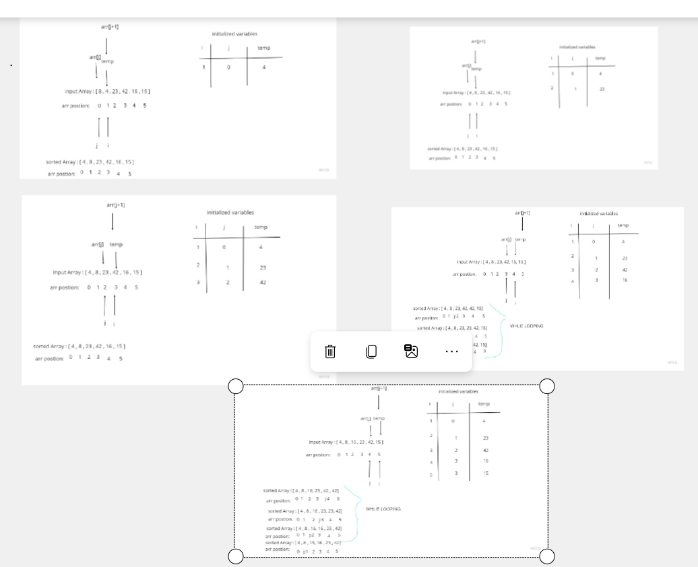

# Insertion Sort
Provided with the following code, walk through the values at each loop and code/test the solution.
```
  InsertionSort(int[] arr)

    FOR i = 1 to arr.length

      int j <-- i - 1
      int temp <-- arr[i]

      WHILE j >= 0 AND temp < arr[j]
        arr[j + 1] <-- arr[j]
        j <-- j - 1

      arr[j + 1] <-- temp
```
## Whiteboard Process:


## test:


## Approach & Efficiency

Time = O(n^2) 
Space = O(1) 
