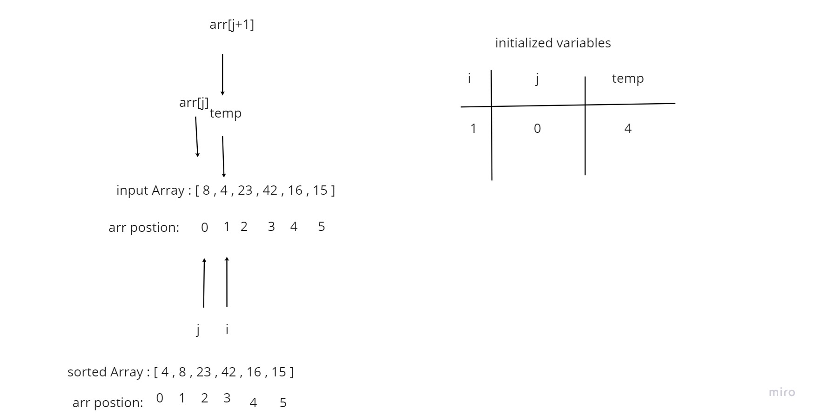
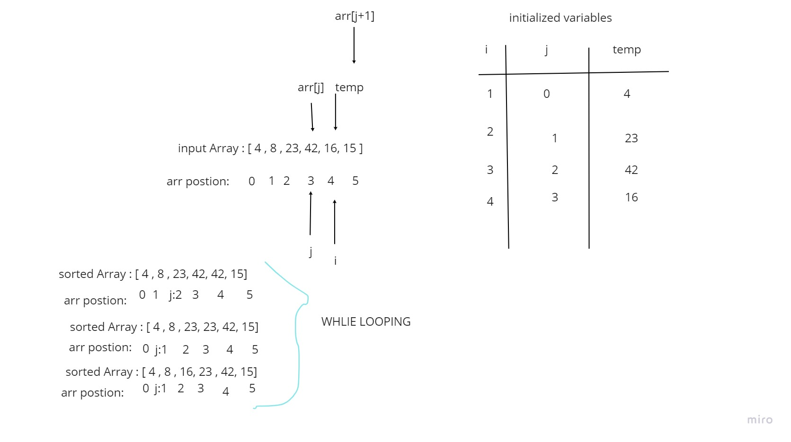

# Insertion Sort Blog
## The Psudeo Code
  InsertionSort(int[] arr)

    FOR i = 1 to arr.length

      int j <-- i - 1
      int temp <-- arr[i]

      WHILE j >= 0 AND temp < arr[j]
        arr[j + 1] <-- arr[j]
        j <-- j - 1

      arr[j + 1] <-- temp

## Pass 1:

This algorithm enters right into a for loop and remains there until the function is complete.

For the array [8,4,23,42,16,15], i starts at 1, j starts at 0, and temp starts at 4. The While loop condition is met since j is greater than 0 and temp (4) is less than arrj. As a result the value in the array at index 1 is set to 8 (where the value was 4), and j is now equal to -1. Now that j is less than 0, the while loop condition is no longer met and we break out.

Finally the value in the array at position 0 is set equal to the temp value (4), and the first pass is complete.

## pass 2:

Pass 2 starts with i at 2, j at 1, and temp at 23. Since temp (23) is greater than arr[j] (8), the while loop condition is never met. The value in the array at index j+1 remains the same.

## pass 3:

Pass 3 starts with i at 3, j at 2, and temp at 42. Since temp (42) is greater than arr[j] (23), the while loop condition is never met. The value in the array at index j+1 remains the same.

## pass 4:

Pass 4 starts with i at 4, j at 3, and temp at 16. Temp (16) is less than arr[j] (42) and j is greater than 0, meeting the while loop condition. The value in the array at index 4 is then set to 42, and j is reduced by 1 to 2.

With j at 2, Temp (16) is less than arr[j] (23) and j is greater than 0, meeting the while loop condition. The value in the array at index 3 is then set to 23, and j is reduced by 1 to 1.

With j at 1, Temp (16) is greater than arr[j] (8) so the while loop condition is no longer met. The value in the array at index 2 is then set to temp (16).

## pass 5:

Pass 5 starts with i at 5, j at 4, and temp at 15. Temp (15) is less than arr[j] (42) and j is greater than 0, meeting the while loop condition. The value in the array at index 5 is then set to 42, and j is reduced by 1 to 3.

With j at 3, Temp (15) is less than arr[j] (23) and j is greater than 0, meeting the while loop condition. The value in the array at index 4 is then set to 23, and j is reduced by 1 to 2.

With j at 2, Temp (15) is less than arr[j] (16) and j is greater than 0, meeting the while loop condition. The value in the array at index 3 is then set to 16, and j is reduced by 1 to 1.

With j at 1, Temp (15) is greater than arr[j] (8) so the while loop condition is no longer met. The value in the array at index 2 is then set to temp (15).
