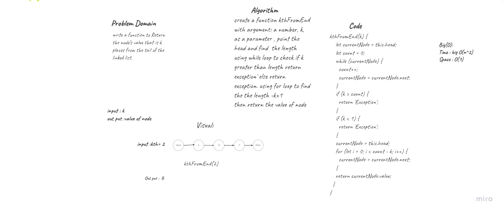
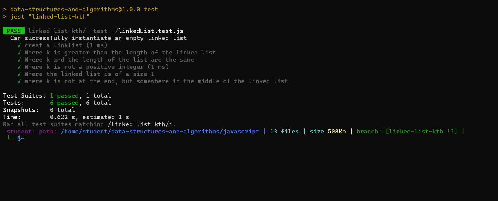

# Challenge Summary

 Kth From End: Find the kth node from the end of the list

 ##  Whiteboard Process: 

 
## Approach & Efficiency:
big O(n^2) Time & big O(1) Space for kth from end

## testing : 
