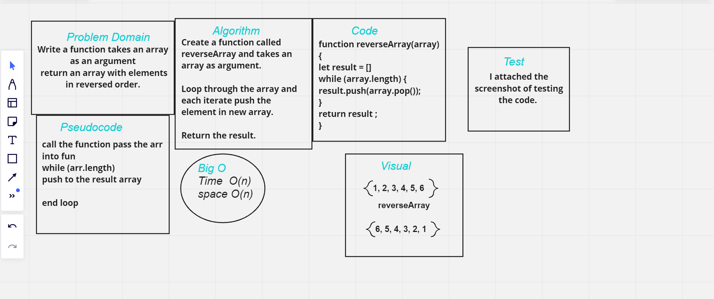
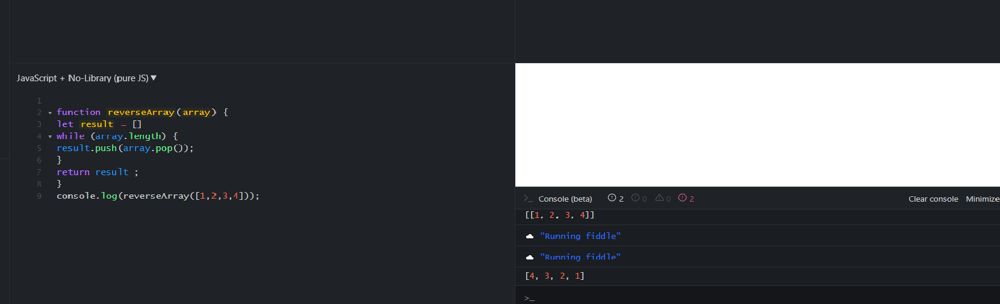

# Reverse an Array

## Made a function takes an array as an argument return an array with elements in reversed order.

 # Whiteboard Process:

 

 ## Screenshoot for testing my Code:
 

# Approach & Efficiency:

## What approach did you take ,  Discuss Why. ?
### used while to reverse the array and push method.

## What is the Big O space/time for this approach?
### Time is O  (n)
### Space is O (n)

[Code challenge](../code-challenges)