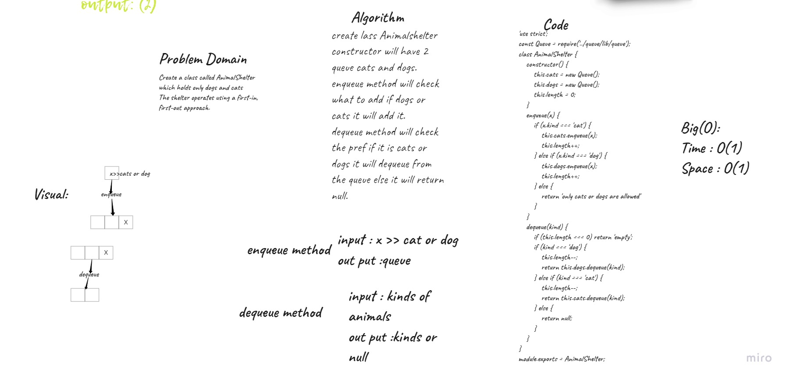

# Challenge Summary
Create a class called AnimalShelter which holds only dogs and cats.
The shelter operates using a first-in, first-out approach.
## whitboard process

## Approach & Efficiency
Enqueue: space O(1)/time O(1)
Dequeue: space O(1)/time O(1)