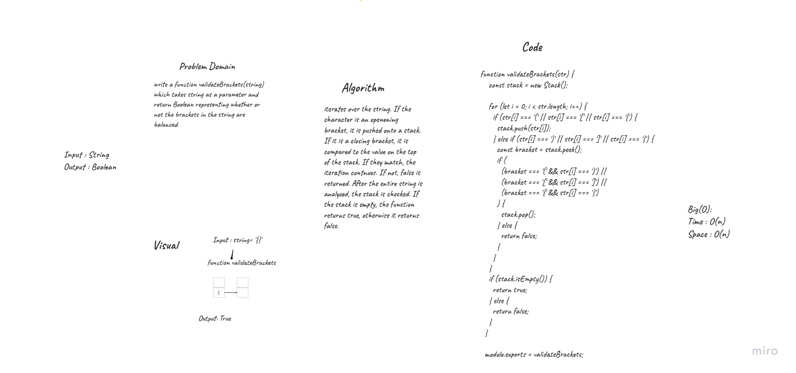
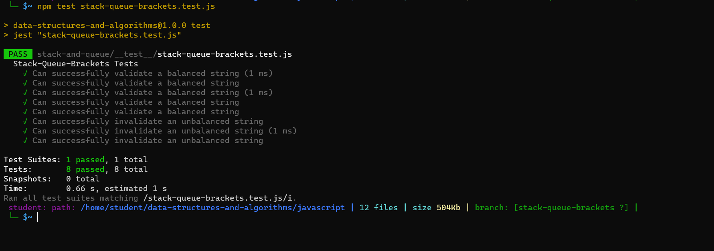

# validateBrackets(string)
# Challenge Summary
Create validateBrackets(string) function which takes string as a parameter and return boolean representing whether or not the brackets in the string are balanced.

# Whiteboard Process

# Test 
