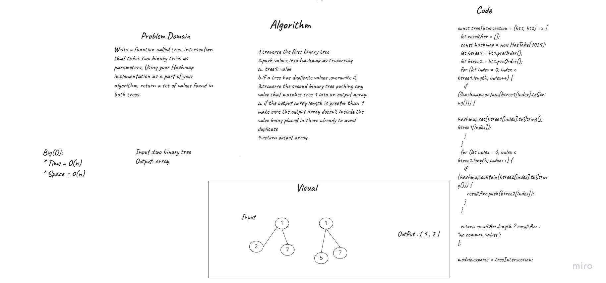

# tree-intersection

## Challenge Summary:
Write a function called tree_intersection that takes two binary trees as parameters, Using your Hashmap implementation as a part of your algorithm, return a set of values found in both trees.

## whiteboard 

## test 

## Approach & Efficiency
time: O(n)

space: O(n)