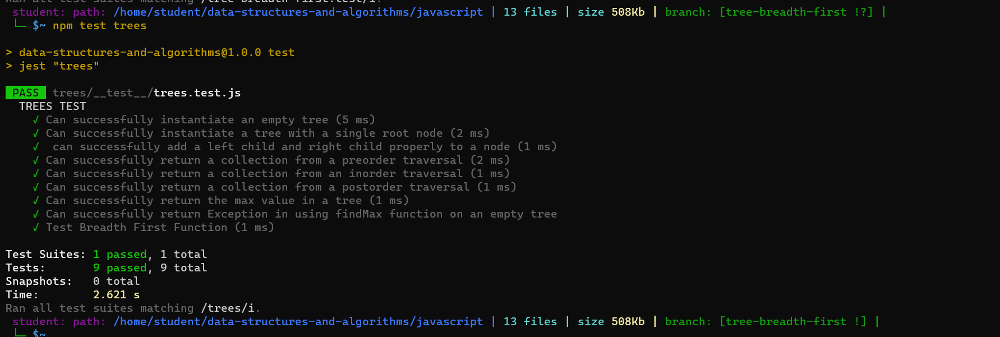

# Binary Tree Breadth First Traverse
Write a function that takes in a binary tree as an argument and returns an array of values encountered during a breadth first traversal of the tree.

# Whiteboard Process

test 
