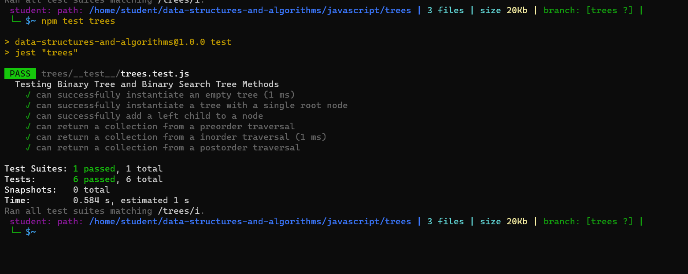

# Binary Tree and Binary Search Tree

## Challenge
Create Node, BinaryTree and BinarySearchTree classes and create preOrder(),inOrder(), postOrder() to traverse a tree and return it's nodes as an array of their values. Also we should create add(value) function to add a node in the correct location in the binary search tree, and contains(value) function to check if a value is existed in a binary search tree or not.

# Test

## Approach & Efficiency

Binary Search Tree Methods Efficiency:

preOrder: 0(n), as it cycles through each value in the tree once, scales directly with n
inOrder: 0(n), as it cycles through each value in the tree once, scales directly with n
postOrder: 0(n), as it cycles through each value in the tree once, scales directly with n
add(val) 0(logn), it only tranverses a few nodes to get to the appropraite location, as n scales this becomes more efficient
contains(val) BST only: it only tranverses a few nodes to get to the appropraite location, as n scales this becomes more efficient